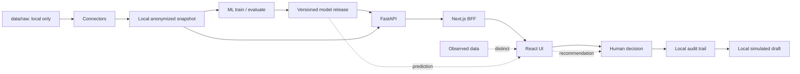

# ФОРПОСТ — ситуационный центр АО «Москоллектор»

ФОРПОСТ — локальный веб-ситуационный центр для поддержки диспетчерских решений
в инженерных коллекторах. Он отделяет подтверждённые наблюдения от прогноза,
не автоматизирует действия диспетчера и сохраняет проверяемую цепочку решения
до локального черновика заявки.

## Что реализовано

- веб-ситуационный центр на Next.js и FastAPI;
- локальный обезличенный snapshot: UI не читает `data/` напрямую;
- 24-часовой proxy ML-прогноз риска прекращения ожидаемой телеметрии;
- факторы модели, версия, evidence tier и отдельная observed telemetry;
- human-in-the-loop решение диспетчера с причиной;
- локальный audit trail с проверкой целостности;
- серверное формирование локального `simulated` draft заявки;
- RBAC/ABAC, CSRF/origin checks, rate limiting и integrity checks;
- автоматические frontend/Python-тесты и GitHub Actions CI.

## Что ограничено входными данными

| Направление | Статус | Причина |
| --- | --- | --- |
| Пожарный риск | недоступен | Нет подтверждённых связанных источников и target labels. |
| Несанкционированный доступ | недоступен | Нет подтверждённых журналов СКУД, допусков и target labels. |
| Износ инфраструктуры | недоступен | Нет подтверждённого реестра ТО/ремонтов и target labels. |

Это инженерная граница: при отсутствии подтверждённого источника и разметки
система fail-closed и не публикует фиктивную вероятность. Единственная
доступная ML-задача — `sensor_failure`: proxy риска тишины телеметрии, а не
диагноз физического отказа датчика.

## Сквозной сценарий

**наблюдение → прогноз → факторы → observed telemetry → решение диспетчера → audit → draft заявки**

## Как проверить за 2 минуты

После локального запуска откройте `http://127.0.0.1:3000`.

1. [`/`](http://127.0.0.1:3000/) — оперативную сводку, временную шкалу и только подтверждённые наблюдения локального snapshot.
2. [`/sensor-failure`](http://127.0.0.1:3000/sensor-failure) — 24-часовой proxy, evidence tier, раздельные validation/final-test метрики и ограничения модели.
3. [`/notifications`](http://127.0.0.1:3000/notifications) — связь прогноза, факторов, observed telemetry и ручного решения; сценарий появляется при валидном локальном prediction export.
4. [`/journals`](http://127.0.0.1:3000/journals) — журнал наблюдений, фильтры, карточку и решение с причиной без изменения исходного факта.
5. [`/applications`](http://127.0.0.1:3000/applications) — связанный локальный `simulated` draft; он не отправляется во внешнюю ИС.
6. [`/topology`](http://127.0.0.1:3000/topology) — негеографическую схему объектов: ID и иерархия из snapshot, координаты явно `simulated`.

Если нет локального snapshot или проверенного prediction export, экран честно
покажет недоступность. Их нельзя заменять демонстрационными значениями.

## Архитектура и семантика данных



`observed` — факт из локального источника; `prediction` — результат
проверенного ML-релиза; `recommendation` — помощь человеку, не команда;
`simulated` draft — локальный результат demo-workflow. Эти сущности не
взаимозаменяемы.

## Текущее состояние ML

Локальный release `v10` оценивает `cadence_adjusted_silence_horizon_proxy_v2`
на горизонте 24 часа. CatBoost, sigmoid-калибровка, point-in-time признаки,
temporal split, purge/embargo, отдельная calibration и final untouched test
сохранены в методике. Модельный bundle и export проверяются manifest SHA-256
перед read-only выдачей.

| Метрика | Validation | Final test |
| --- | ---: | ---: |
| Precision | 0.585 | 0.608 |
| Recall | 0.816 | 0.826 |
| F1 | 0.680 | 0.700 |
| PR-AUC | 0.632 | 0.797 |
| ROC-AUC | 0.831 | 0.918 |
| Brier score | 0.152 | 0.109 |
| ECE | 0.091 | 0.069 |

`v10` имеет статус `limited`: измеренные значения не подменяются и не
выдаются за production SLA. Внутренние policy-gates выбираются при
проектировании по качеству источника; они не являются фиксированным
требованием ТЗ. Само ТЗ требует определить целевые Precision/Recall на этапе
проектирования. Подробнее: [ML_METHODS.md](docs/ML_METHODS.md) и
[ML_CAPABILITIES.md](docs/ML_CAPABILITIES.md).

## Быстрый локальный запуск

Windows:

```powershell
.\scripts\setup-demo.ps1
.\.venv\Scripts\Activate.ps1
npm run dev:stack
```

Linux/macOS:

```sh
sh scripts/setup-demo.sh
. .venv/bin/activate
npm run dev:stack
```

`setup-demo` не читает `data/raw`, не строит snapshot и не обучает модель.
Создание локального snapshot и demo-сессии описаны в
[LOCAL_VERIFY.md](docs/LOCAL_VERIFY.md). Для воспроизводимой экспертизы кода:

```powershell
npm run verify:submission:fast
```

Быстрая проверка выполняет typecheck, lint, Ruff, staged/tracked perimeter,
reviewer-document consistency и `git diff --check`. Полная локальная проверка:

```powershell
npm run verify:submission:full
```

Она дополняет fast suite frontend tests, build, pytest, Ruff format, Bandit и
load check. Обе команды не читают `data/raw`, `data/processed` или `ml/models`.

## Screenshots

Репозиторий не содержит макетов вместо работающего интерфейса. Реальные
скриншоты можно добавить в [docs/assets/screenshots](docs/assets/screenshots/)
по [чек-листу](docs/assets/screenshots/README.md): обзор, ML quality,
notifications и decision/applications.

## Данные и безопасность

- В Git допустим только [data/README.md](data/README.md); `data/raw` и
  `data/processed` игнорируются и блокируются hooks, CI и server-side guard.
- Локальный стек слушает только `127.0.0.1`; reverse proxy, LAN и Internet
  deployment не поддерживаются.
- BFF использует локальный service-token для чтения; demo-write требует
  отдельного короткоживущего assertion, RBAC/ABAC, origin и CSRF.
- Локальный SHA-256 manifest обнаруживает подмену artefact, но не заменяет
  подпись издателя, IdP/MFA, SIEM, TLS, backup или production deployment.

## Документация

Начните с [START_HERE.md](START_HERE.md) и руководства эксперта
[LTC_2026_SUBMISSION.md](LTC_2026_SUBMISSION.md).

- [PROJECT_PASSPORT.md](PROJECT_PASSPORT.md) — фактическое состояние стенда.
- [DEMO_SCRIPT.md](docs/DEMO_SCRIPT.md) — безопасная пятиминутная демонстрация.
- [ARCHITECTURE.md](docs/ARCHITECTURE.md) — архитектура и границы интеграции.
- [ML_METHODS.md](docs/ML_METHODS.md) — методика, ограничения и защита final test.
- [ML_CAPABILITIES.md](docs/ML_CAPABILITIES.md) — доступность четырёх направлений.
- [DATA_CARD.md](docs/DATA_CARD.md) — безопасный локальный формат Data Card.
- [PERFORMANCE.md](docs/PERFORMANCE.md) — воспроизводимый inference benchmark.
- [TZ_COMPLIANCE.md](docs/TZ_COMPLIANCE.md) — доказательства соответствия ТЗ.
- [SECURITY_AUDIT.md](docs/SECURITY_AUDIT.md) — результаты и ограничения ИБ.
- [TEST_PROTOCOL.md](docs/TEST_PROTOCOL.md) — автоматические и ручные проверки.
- [LOCAL_VERIFY.md](docs/LOCAL_VERIFY.md) — локальный периметр, setup и security checks.
